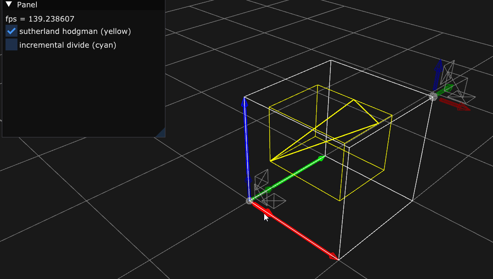
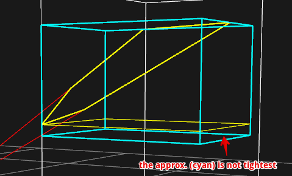
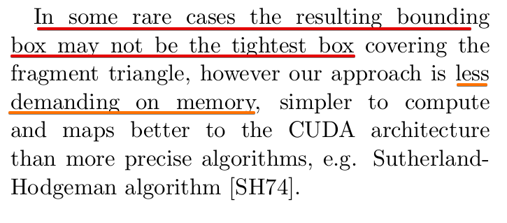

## Sutherland-Hodgman Polygon Clipping

## Approximation with mutliple divisions

from Piotr et al. "Binned SAH Kd-Tree Construction on a GPU"
 

## ref
- Sutherland-Hodgman Polygon Clipping Algorithm, https://www.youtube.com/watch?v=Euuw72Ymu0M
- Binned SAH Kd-Tree Construction on a GPU, https://www-sop.inria.fr/members/Stefan.Popov/media/KDTConstructionGPU_TR10.pdf
    - for good approximation